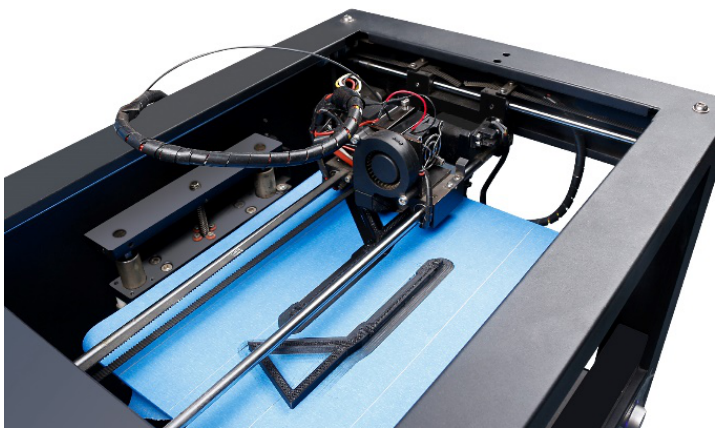
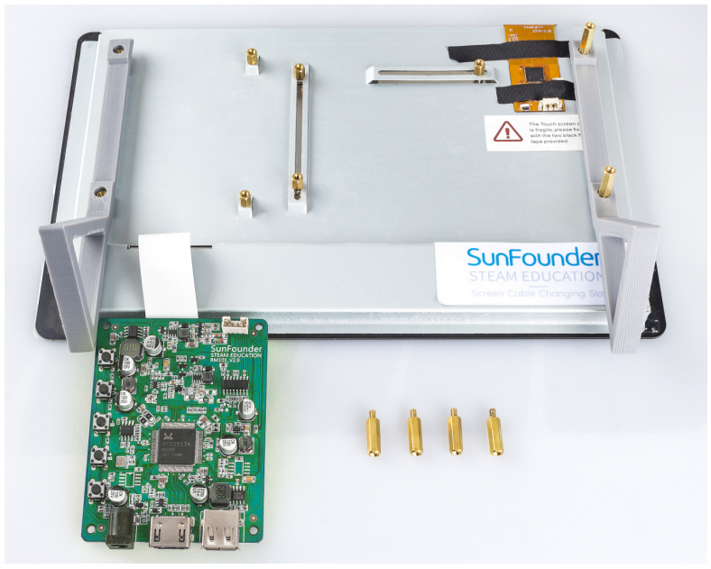
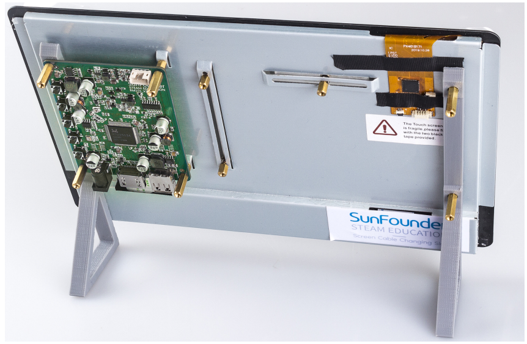

.. note::

    Hello, welcome to the SunFounder Raspberry Pi & Arduino & ESP32 Enthusiasts Community on Facebook! Dive deeper into Raspberry Pi, Arduino, and ESP32 with fellow enthusiasts.

    **Why Join?**

    - **Expert Support**: Solve post-sale issues and technical challenges with help from our community and team.
    - **Learn & Share**: Exchange tips and tutorials to enhance your skills.
    - **Exclusive Previews**: Get early access to new product announcements and sneak peeks.
    - **Special Discounts**: Enjoy exclusive discounts on our newest products.
    - **Festive Promotions and Giveaways**: Take part in giveaways and holiday promotions.

    👉 Ready to explore and create with us? Click [|link_sf_facebook|] and join today!

3D-PRINTED SUPPORT
==================================

If you need to place the touch screen more conveniently, you can use a 3D printer to print a support. 

The 3D printer file: :download:`Stand <download/Stand.zip>`

Installation process are shown as follow.

**Step 1**

Get ready for 3D printing.

**Step 2**

Remove the touch screen main board and let the standoff thread the holes of holders.

**Step 3**

Assemble the extension board again, now you can get a stand-up touch screen.

