ASSEMBLY INSTRUCTIONS
======================================

**Step1**

Fix the Raspberry Pi (or other boards) on the screen back case. There are a vertical slot and a horizontal one on the back of the screen, so you can fix boards with different sizes by moving the nuts and 2.5*6 standoffs with the small wrench.

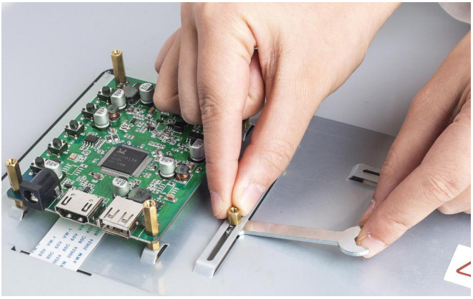

**Step2**

If you want to use a Raspberry Pi with the screen, then you don't need to adjust the standoffs since they are preset for it. Just place the Raspberry Pi on the plate and fasten them with 2.5*14.4 standoffs. 

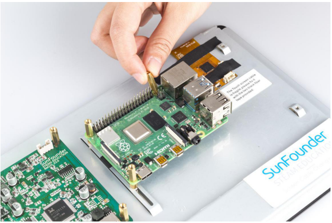

Of course you also adjust the position of the standoffs to mount other boards.

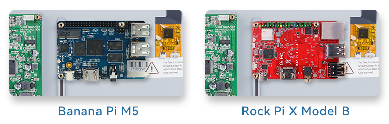
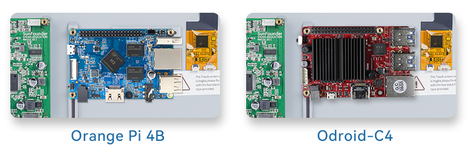
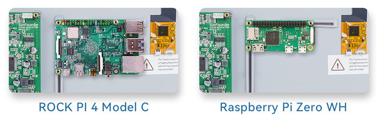
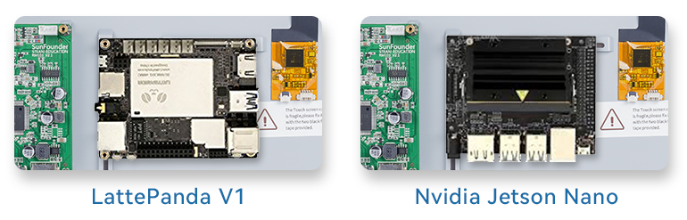

**Step3**

Insert the two 2.5*22 standoffs into the holes on the back to keep the screen balanced. 

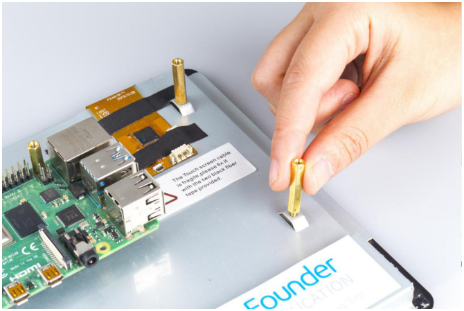

**Step4**

Connect the HDMI port of the Raspberry Pi and the screen via an HDMI cable. 

.. note::
    In this kit, 2 types of HDMI cables and 2 types of power cords of Raspberry Pi are provided for Raspberry Pi 3 and Raspberry Pi 4. 
	
Pi 4

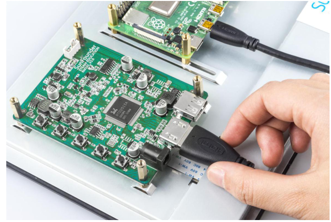

pi 3

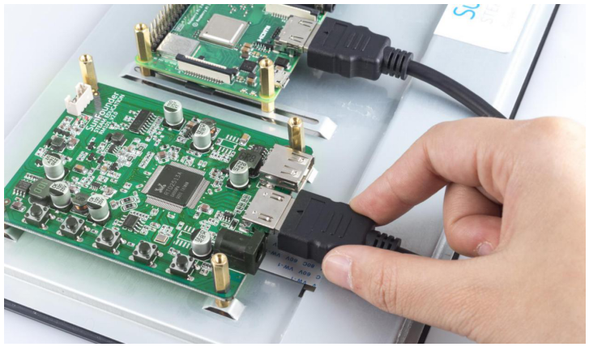

**Step 5**

Connect the power port of the Raspberry Pi to the USB port of the main board via a USB cable. 

Pi 4

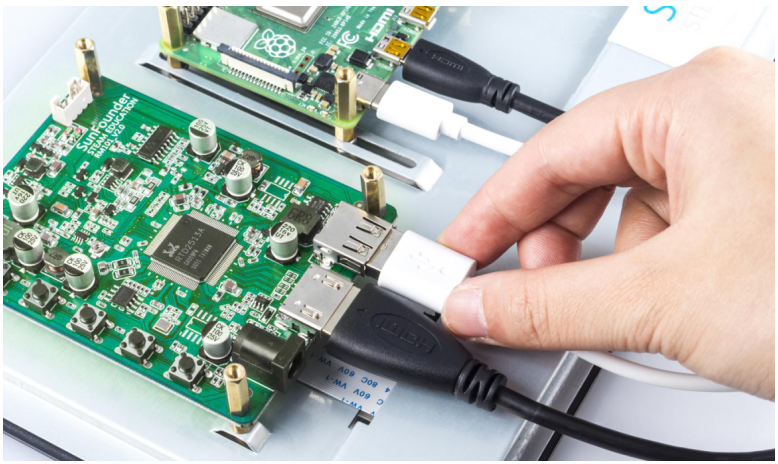

Pi 3

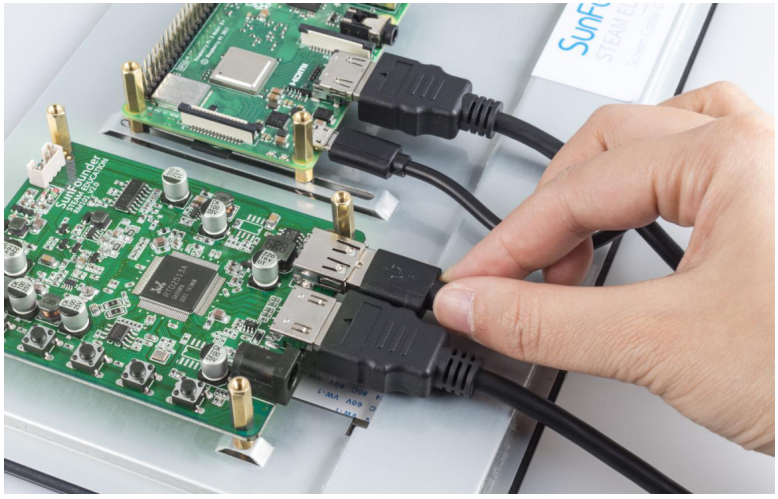

**Step 6**

Connect the USB port of the Raspberry Pi and the screen with a 4-pin USB cable. To prevent the cable from falling off, use tape to fix it.

.. note::
    In the following assembly steps, the method of Raspberry Pi 3 is the same as that of Raspberry Pi 4, so we take Raspberry Pi 4 as an example to introduce. 
	
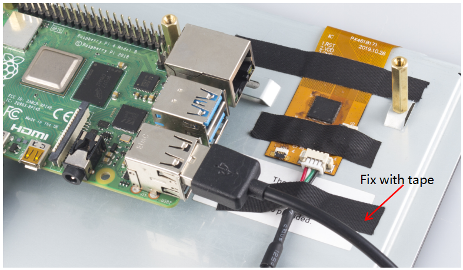

**Step 7**

Connect the power cable of the supply to power the main board of the screen. 

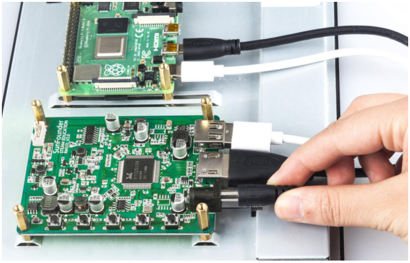

**Step 8**

Then power it on and the **boot screen** will appear. 

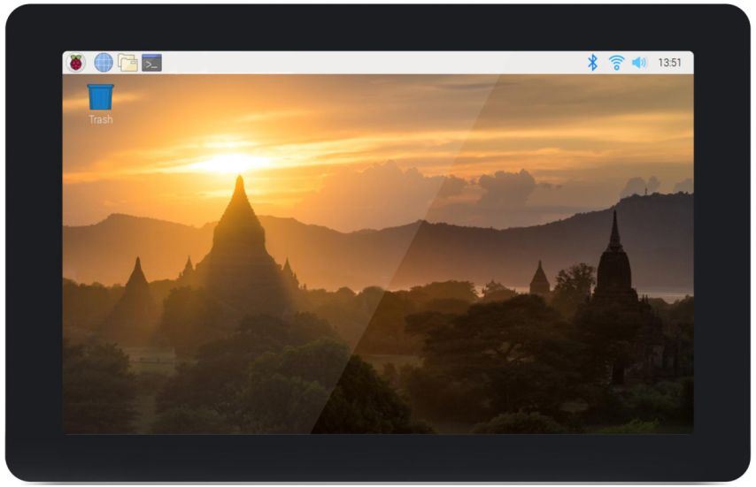
