.. note::

    Hello, welcome to the SunFounder Raspberry Pi & Arduino & ESP32 Enthusiasts Community on Facebook! Dive deeper into Raspberry Pi, Arduino, and ESP32 with fellow enthusiasts.

    **Why Join?**

    - **Expert Support**: Solve post-sale issues and technical challenges with help from our community and team.
    - **Learn & Share**: Exchange tips and tutorials to enhance your skills.
    - **Exclusive Previews**: Get early access to new product announcements and sneak peeks.
    - **Special Discounts**: Enjoy exclusive discounts on our newest products.
    - **Festive Promotions and Giveaways**: Take part in giveaways and holiday promotions.

    👉 Ready to explore and create with us? Click [|link_sf_facebook|] and join today!

ASSEMBLY INSTRUCTIONS
======================================

**Step 1: Mount the Raspberry Pi or Other Boards**

Secure the Raspberry Pi (or other compatible boards) onto the back case of the screen. There are two slots provided: a vertical slot and a horizontal slot. These slots are designed to accommodate boards of different sizes. Adjust the nuts and standoffs using the provided small wrench to ensure a snug fit for your board.

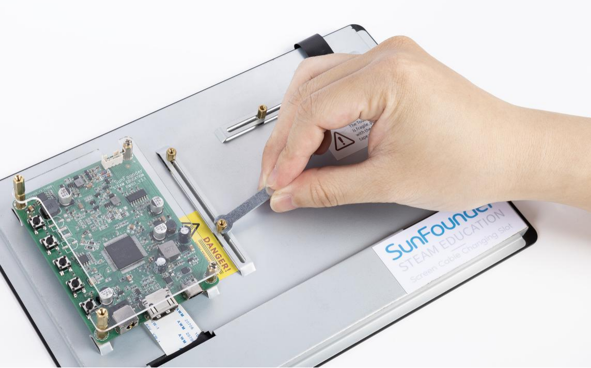

**Step 2: Attach the Raspberry Pi to the Plate**

For Raspberry Pi users, the standoffs are preset for optimal fit. Simply place the Raspberry Pi onto the mounting plate and secure it using the provided **M2.5*18 standoffs**. Tighten them firmly to ensure the board is stable.

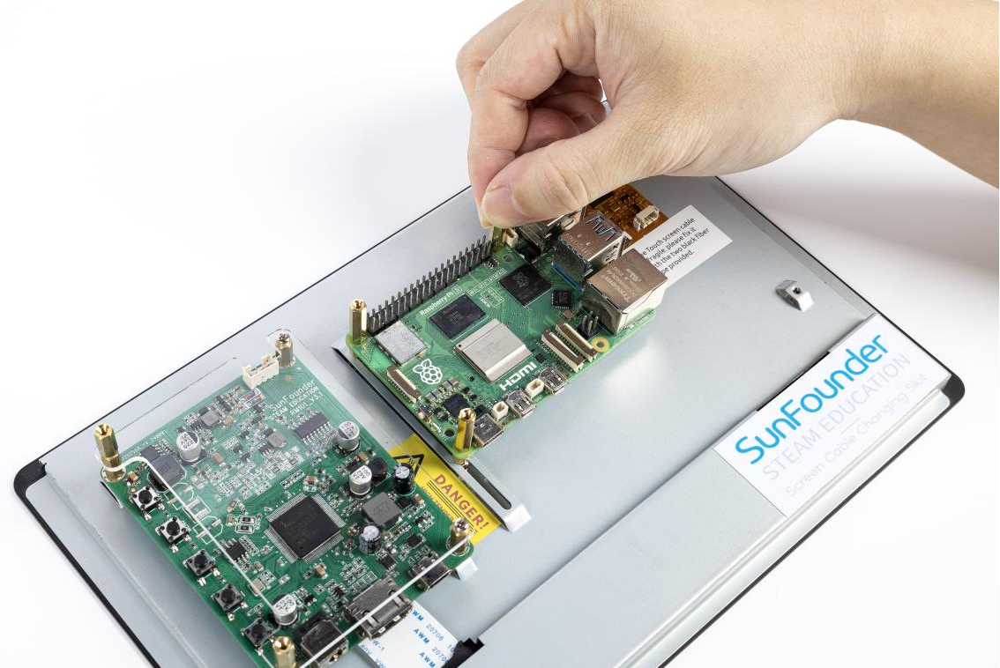

**Step 3: Secure the Acrylic Protective Plate**

Align the acrylic protective plate over the Raspberry Pi and secure it in place using the **M2.5*6 screws**. Ensure that the plate is tightly fastened to protect the board during operation.

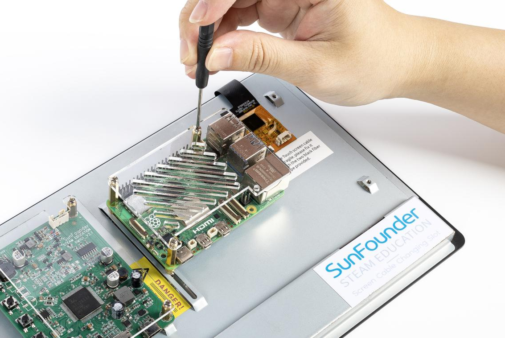

**Step 4: Insert Balancing Standoffs**

Insert two **M2.5*30 standoffs** into the designated holes on the back of the screen to provide balance and stability. These standoffs will prevent the screen from tilting or wobbling.

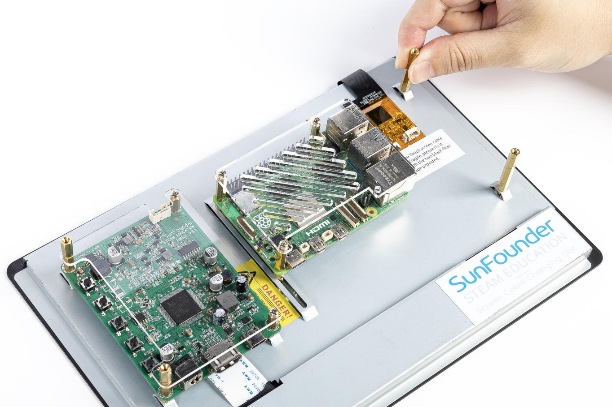

**Step 5: Connect Speaker Wires**

Carefully insert the speaker wires into the pins as shown in the provided image. Ensure that the connections are secure and follow the orientation in the diagram to avoid errors.

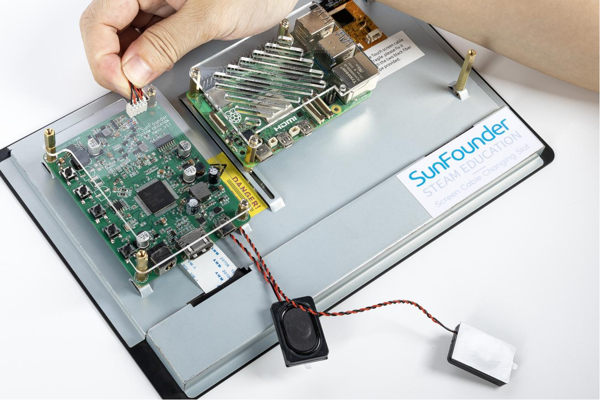

**Step 6: Attach the Speaker**

Place the speaker into its designated slot and secure it. Check that the speaker is properly aligned and firmly attached to avoid any vibrations during use.

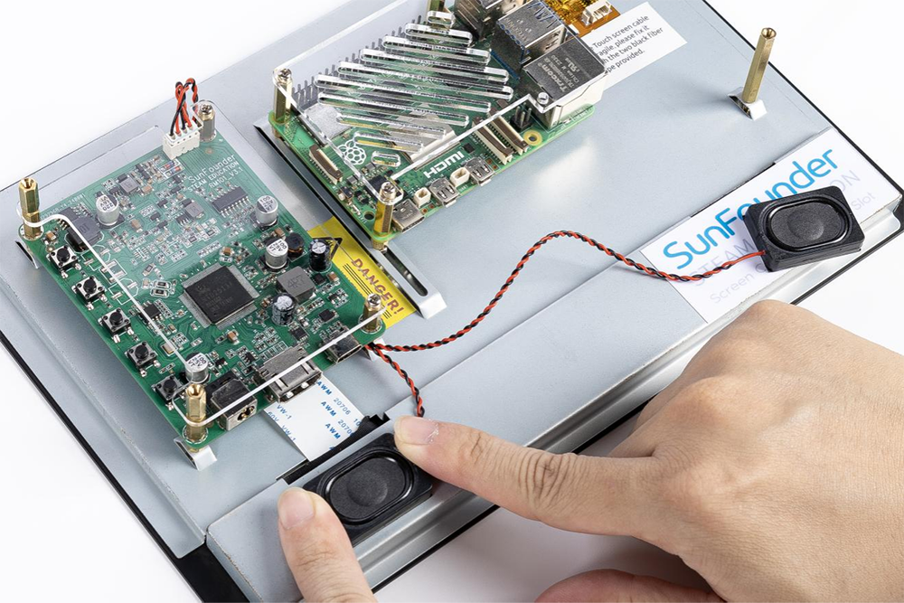

**Step 7: Secure Speaker Wires**

Use adhesive tape to neatly secure the speaker wires to the back of the screen. This prevents the wires from moving or getting caught during assembly or operation.

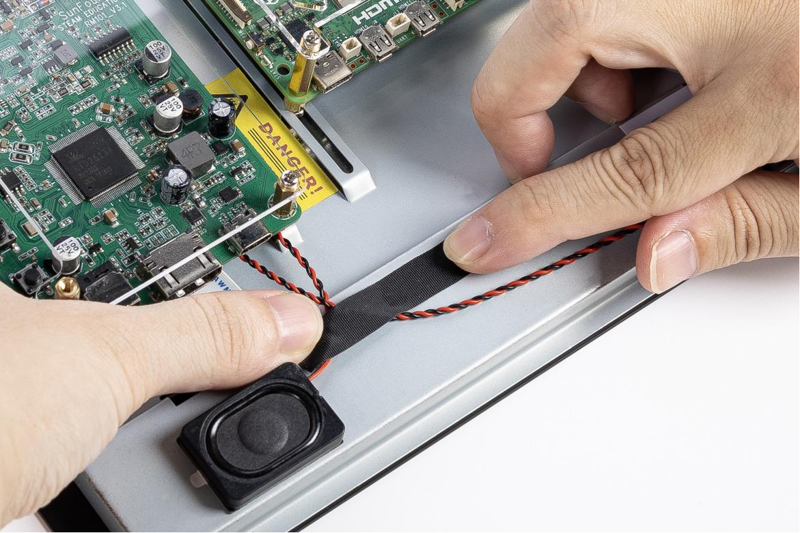

**Step 8: Connect the HDMI Cable**

Connect the HDMI port of your Raspberry Pi (either version 4 or 5) to the screen's HDMI input using the HDMI cable provided. Ensure the cable is inserted completely for a stable video signal.

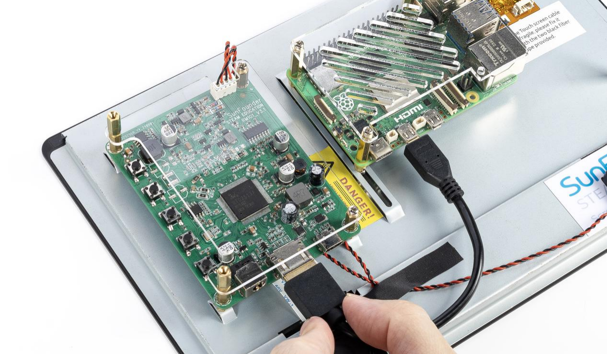

**Step 9: Connect the USB Power Cable**

Connect the power port of the Raspberry Pi to the USB port on the screen's main board using a USB cable. Ensure the cable is securely connected at both ends to prevent power interruptions.

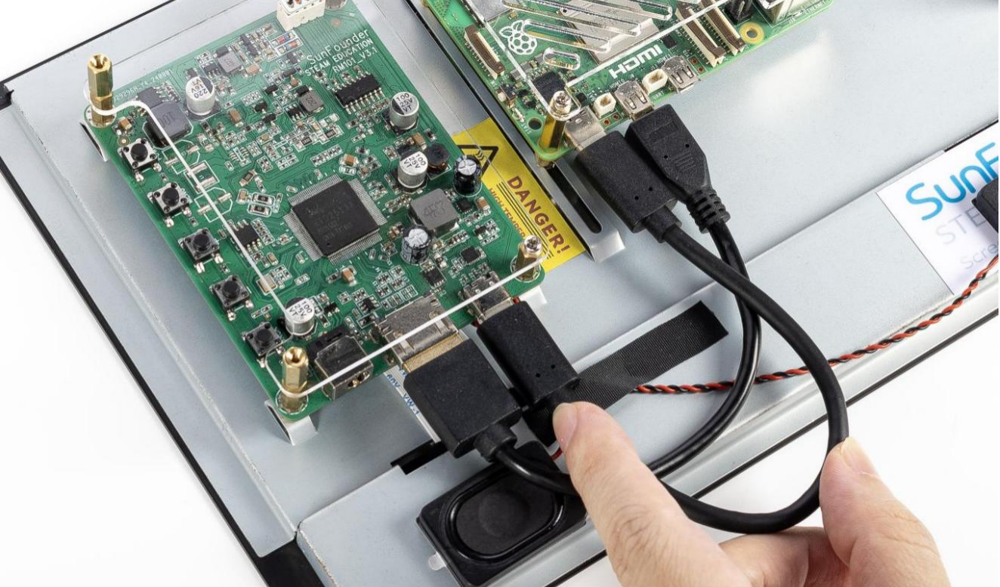

**Step 10: Connect the USB Data Cable**

Use the provided 4-pin USB cable to connect the USB port of the Raspberry Pi to the screen. To avoid accidental disconnections, use adhesive tape to secure the cable in place after plugging it in firmly.

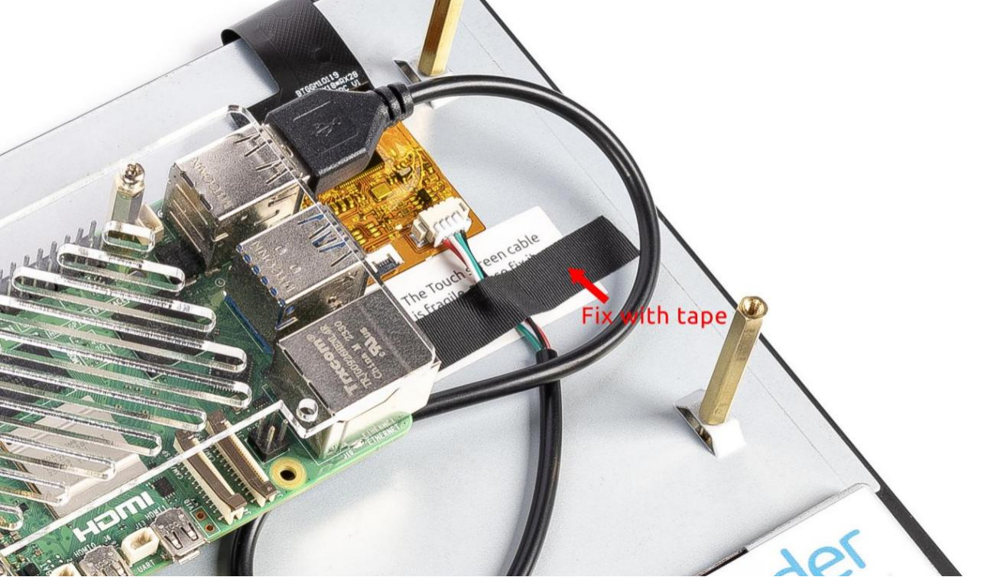

**Step 11: Power the Screen and Prepare the Raspberry Pi**

Connect the power cable from your power supply to the main board of the screen. Before powering on, ensure you have followed the steps below to set up your Raspberry Pi:

* Refer to the online tutorials: https://ts-10.rtfd.io.
* Install Raspberry Pi OS onto a Micro SD card.
* Insert the Micro SD card into the Raspberry Pi.

After completing these steps, plug in the power cable to the main board.

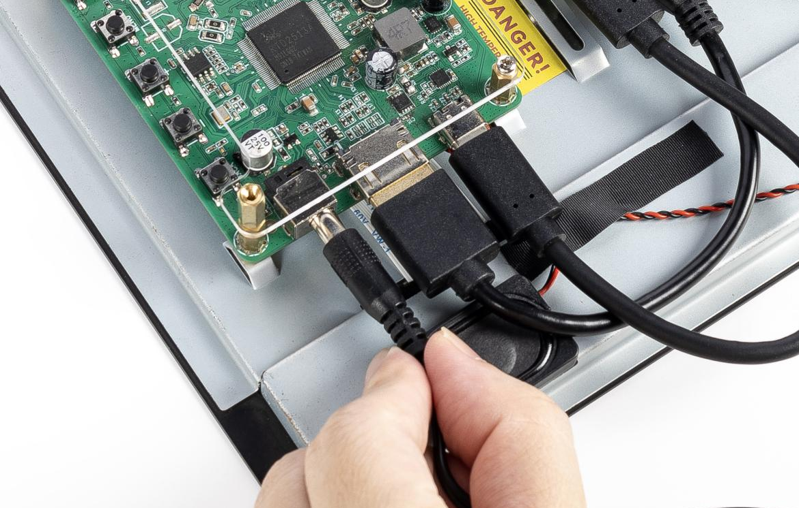

**Step 12: Power On the System**

Once all connections are in place, power on the system. The boot screen should appear, indicating that the screen and Raspberry Pi are functioning correctly. If the screen does not power on, double-check the connections and refer to the online tutorials for troubleshooting.

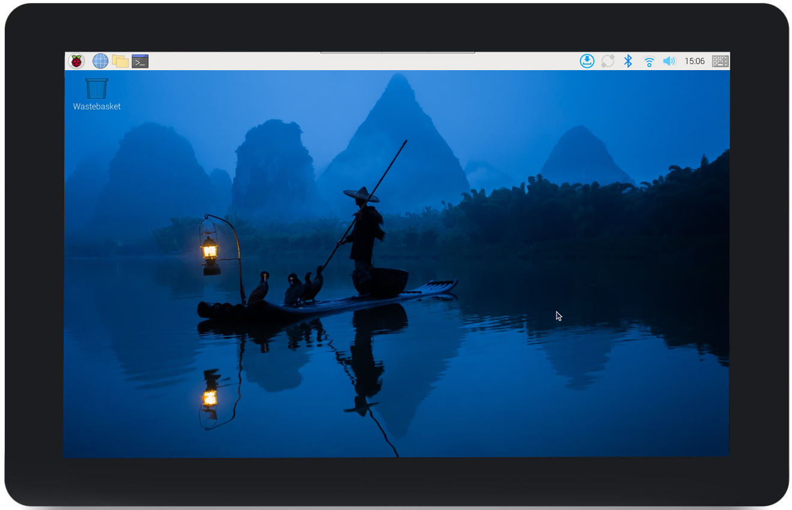

