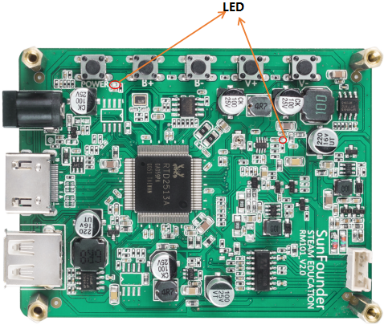
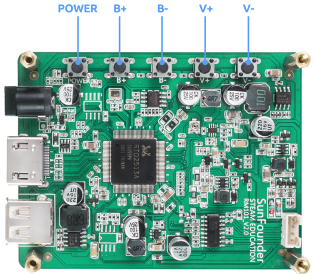
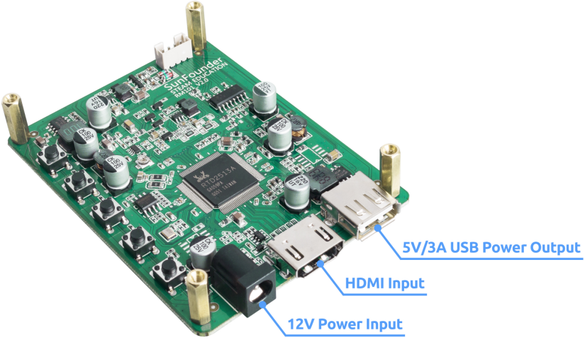

Hardware Description
=======================

**LED Indicators**

There are 2 LED indicators on the main board of the screen to show different signals: 

* Power on the screen, after the green LED flashes one time, it lights on continuously; and the red LED lights on immediately.
* If there's no HDMI signal, only the red LED will turn on.
* If there's an HDMI signal, these two LEDs will turn on.
* If you press the power button, the green LED will turn off and the red LED will keep turning on.
* If you remove the power cord, both of the two LEDs will turn off.

**Buttons**

Buttons on the main board and their functions: 

Power: Short press to switch ON/OFF(go into the sleep mode) the screen.Long press to power ON/OFF the device(Raspberry Pi).

* B+: Increase screen brightness.
* B-: Reduce screen brightness.
* V+: Volume up.
* V-: Volume down.

On one side of the main board there are ports of HDMI input, 12V power input, and 5V/3A USB power output.

