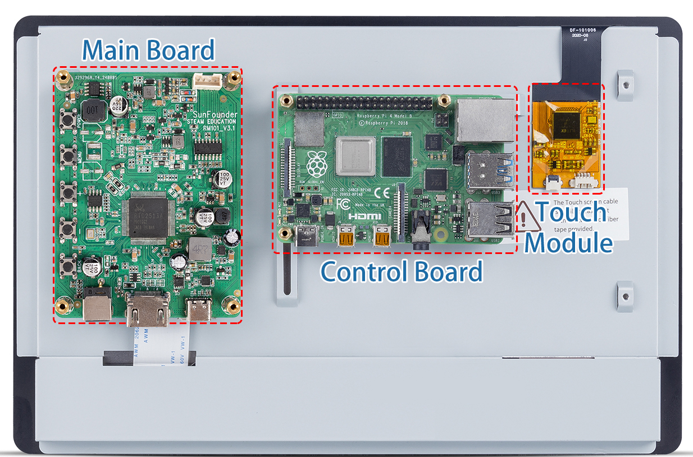
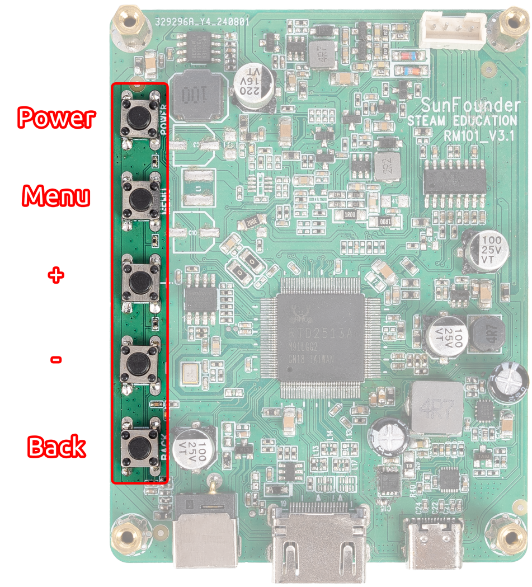
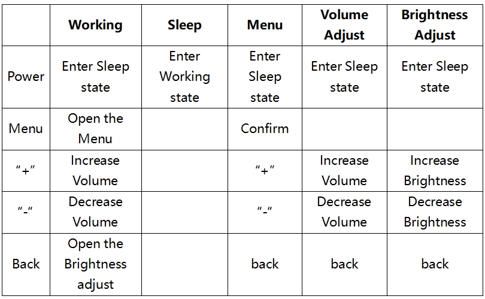
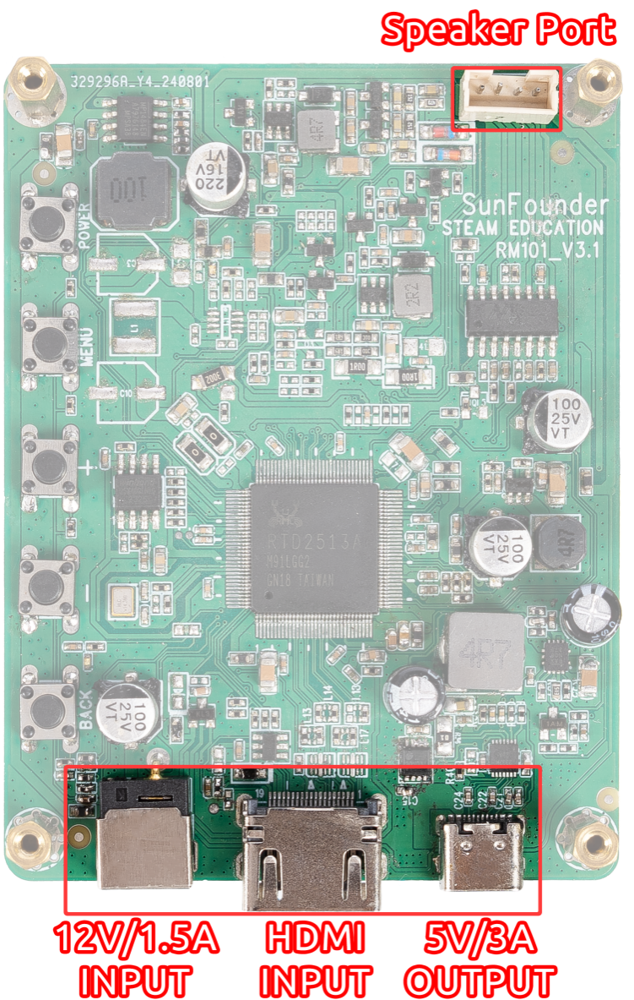

.. note::

    Hello, welcome to the SunFounder Raspberry Pi & Arduino & ESP32 Enthusiasts Community on Facebook! Dive deeper into Raspberry Pi, Arduino, and ESP32 with fellow enthusiasts.

    **Why Join?**

    - **Expert Support**: Solve post-sale issues and technical challenges with help from our community and team.
    - **Learn & Share**: Exchange tips and tutorials to enhance your skills.
    - **Exclusive Previews**: Get early access to new product announcements and sneak peeks.
    - **Special Discounts**: Enjoy exclusive discounts on our newest products.
    - **Festive Promotions and Giveaways**: Take part in giveaways and holiday promotions.

    👉 Ready to explore and create with us? Click [|link_sf_facebook|] and join today!

HARDWARE DESCRIPTION
=======================

* Main Board: It is mounted on top to control the display.
* Control Board: It is a cross slot structure with one side movable, so you can mount different size of control board.
* Touch Module: This is the module used to let the display get the touch function, you need to connect it to the USB port of the control board through the USB cable provided by us.

**Touch Module**

.. image:: img/hardware_touch_module.png
    :width: 500
    :align: center

There are two types of 4pin connector on the touch module, with the pin serial number shown on the figure.

Here are the definitions of the pins:

* Pin 1: VDD(5V)
* Pin 2: D-
* Pin 3: D+
* Pin 4: GND

**LED Indicators**

.. image:: img/hardware_leds.png
    :width: 400
    :align: center

There are 2 LED indicators on the main board of the screen to show different signals: 

* Power on the screen, after the Signal LED flashes one time, it lights on continuously; and the Power LED lights on immediately.
* If there's no HDMI signal, only the Power LED will turn on.
* If there's an HDMI signal, these two LEDs will turn on.
* If you press the power button, the Signal LED will turn off and the Power LED will keep turning on.
* If you remove the power adapter, both of the two LEDs will turn off.

**Buttons**

Buttons on the main board and their functions: 

**Interfaces**

On one side of the Driver Board there are ports of HDMI input, 12V power input, and 5V/3A USB power output and Speaker Port. 

