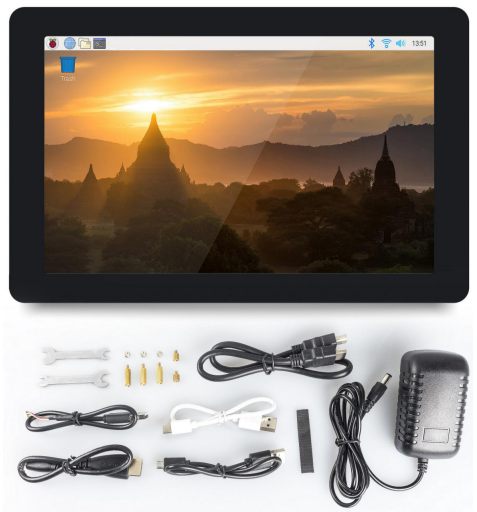

SunFounder TS-10 10.1-inch Touch Screen
===============================================

* **Resolution:** 1280x800
* **Power:** DC 12V/1.5A
* **Consumption:** 4W
* **LCD Type:** IPS
* **Capactive:**
* **Capactive Touch**
* **5-point Touch Screen**

SunFounder 10.1'' IPS monitor is a 5-point capacitive touch screen with a resolution of 1280x800, bringing you perfect visual experience. It works with various operating systems including Raspbian, Ubuntu, Ubuntu Mate, Windows, Android, and Chrome OS (you may need an USB extension cable). 

.. toctree::
    :maxdepth: 3

    hardware_description
    install_the_os
    assembling
    quick_user_guide
    projects_and_activities
    appendix/appendix
    3d_print_support
    faq
	
	
Copyright Notice
--------------------------

All contents including but not limited to texts, images, and code in this manual are owned by the SunFounder Company. You should only use it for personal study,investigation, enjoyment, or other non-commercial or nonprofit purposes, under therelated regulations and copyrights laws, without infringing the legal rights of the author and relevant right holders. For any individual or organization that uses these for commercial profit without permission, the Company reserves the right to take legal action.
