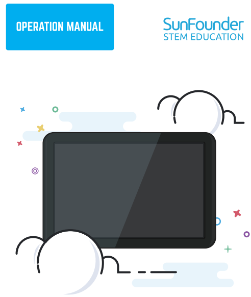

.. toctree::
    :maxdepth: 2

    introduction
    hardware_description
    install_the_system_to_tf_card
    connect_the_raspberry_pi_and_screen
    setting_for_raspberry_pi
    using_as_extension_screen_for_pc
    3D_printed_touch_screen_support
	
	
Copyright Notice
--------------------------

All contents including but not limited to texts, images, and code in this manual are owned by the SunFounder Company. You should only use it for personal study,investigation, enjoyment, or other non-commercial or nonprofit purposes, under therelated regulations and copyrights laws, without infringing the legal rights of the author and relevant right holders. For any individual or organization that uses these for commercial profit without permission, the Company reserves the right to take legal action.
