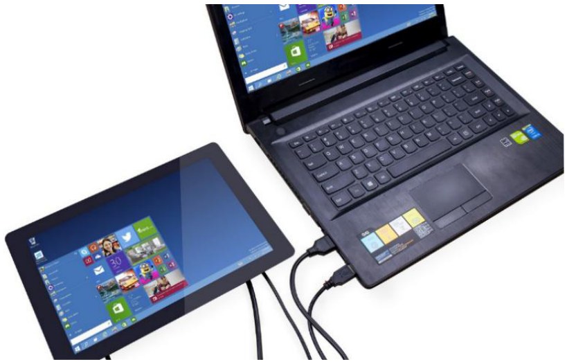

Using as Extension Screen for PC
===================================

Connect the computer with the main board via an HDMI cable, and connect the USB port of the PC and the screen with a 4-pin USB cable. Now you can use the screen as an extension one of your computer. 

